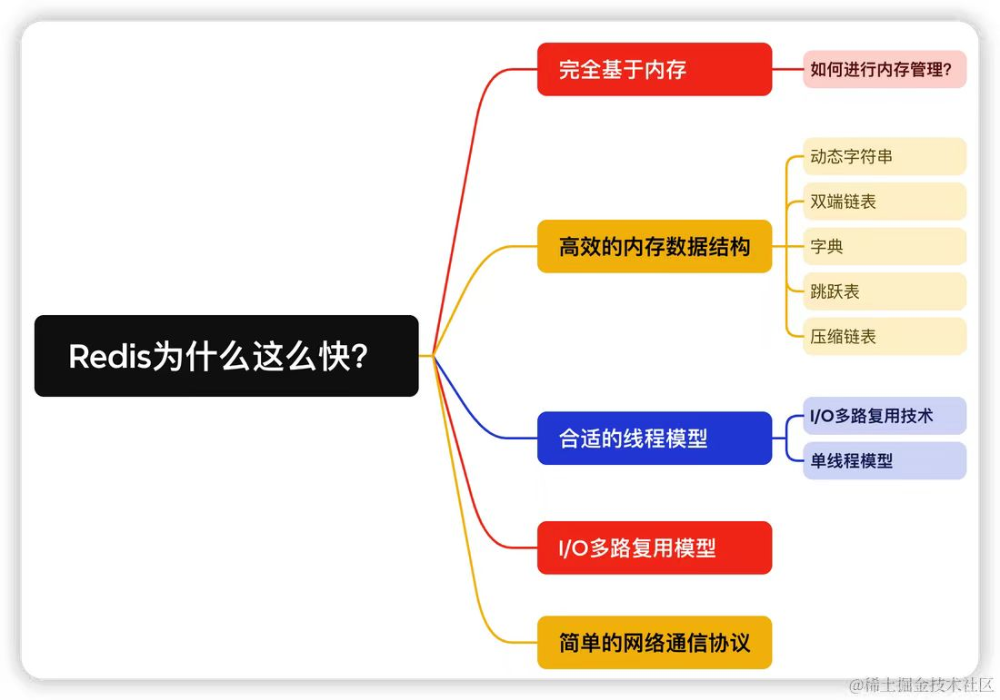

# 常用知识总结

## 1.数据库知识


#### 1.1事务的相关理解


 数据库事务的四大特性通常被称为ACID特性，包括原子性、一致性、隔离性和持久性

这些特性是数据库系统设计的核心原则，确保数据的可靠性和一致性。


原子性(**Atomicity**)

- **定义**：事务中的所有操作要么全部成功，要么全部失败回滚。

- 示例：银行转账操作，如果转账过程中任何一步失败，整个转账操作将回滚，确保账户余额正确

  

**一致性**(Consistency)

- **定义**：事务执行前后，数据库从一个一致性状态变到另一个一致性状态。

- 示例：在转账操作中，无论转账多少次，两个账户的余额之和保持不变

  

隔离性(**Isolation**)

- **定义**：并发执行的事务之间应该互相隔离，一个事务的执行不应该被其他事务干扰。

- 示例：银行柜台处理不同客户的存取款请求，每个客户都认为自己是独占柜台的，不会受到其他客户操作的影响

  

持久性(Durability)

- **定义**：一旦事务提交，其所做的修改将永久保存在系统中，即使系统发生故障也不会丢失。
- **示例**：银行在你完成存款后，即使电力故障，你的存款记录也会安全地保存在账户上


#### 1.2**范式的相关理解**（**三范式**）：


范式(Normal Form)：三范式是数据库设计中的一种规范，它可以帮助我们创建出结构清晰、冗余少、易于维护的数据库。

第一范式（1NF）

- **定义**：确保每个表中的每个字段都是原子的，不可再分的。
- **要求**：每个字段只能包含一个值，不能有重复或多值字段。
- **示例**：
  - **不规范**：一个用户信息表，其中电话号码字段包含了多个号码。
  - 规范：将每个电话号码单独列出，每个用户只有一个电话号码。

第二范式（2NF）

- **定义**：在满足第一范式的基础上，每个非主键字段完全依赖于整个主键，而不是部分依赖于主键的一部分。

- **要求**：表必须满足第一范式。

- **示例**：

  - **不规范**：一个订单表，其中商品名称和单价依赖于商品ID，而不是整个复合主键（订单ID和商品ID）。

  - 规范：将商品信息拆分成一个独立的商品表。

    

第三范式（3NF）

- **定义**：在满足第二范式的基础上，表中的每一个非主键字段都不传递依赖于主键。
- **要求**：表必须满足第二范式。
- **示例**：
  - **不规范**：一个员工信息表，其中部门名称依赖于部门ID，而部门ID依赖于员工ID，即部门名称传递依赖于主键员工ID。
  - 规范：将部门信息拆分成一个独立的部门表。

作用：三范式是可以帮助我们减少数据冗余和提高数据一致性的。


#### 1.3 JDBC的相关知识介绍

JDBC（Java Database Connectivity）是Java语言中用于连接和操作数据库的标准API。在JDBC中，有几个核心的对象，它们各自扮演着不同的角色，共同协作以实现对数据库的访问和操作。以下是JDBC中常用对象的讲解：

1. **DriverManager**

- **作用**：管理一组JDBC驱动程序，并负责将Java应用程序的连接请求与适当的数据库驱动程序匹配。

- 常用方法

  ：

  - `getConnection(String url, String user, String password)`: 获取到数据库的连接。

2. **Connection**

- **作用**：代表与特定数据库的连接（会话）。

- 常用方法

  ：

  - `createStatement()`: 创建一个`Statement`对象。
  - `prepareStatement(String sql)`: 创建一个`PreparedStatement`对象。
  - `prepareCall(String sql)`: 创建一个`CallableStatement`对象。
  - `close()`: 关闭此连接对象。

3. **Statement**

- **作用**：用于执行静态SQL语句并返回其生成的结果。

- 常用方法

  ：

  - `executeQuery(String sql)`: 执行查询操作，返回一个`ResultSet`对象。
  - `executeUpdate(String sql)`: 执行更新操作（如INSERT、UPDATE、DELETE），返回受影响的行数。
  - `execute(String sql)`: 执行任意SQL语句。
  - `close()`: 关闭此`Statement`对象。

4. **PreparedStatement**

- **作用**：预编译的SQL语句对象，用于执行带参数的SQL语句，可以提高性能并防止SQL注入攻击。

- 常用方法

  ：

  - `setXXX(int index, XXX value)`: 设置SQL语句中的参数。
  - `executeQuery()`: 执行查询操作，返回一个`ResultSet`对象。
  - `executeUpdate()`: 执行更新操作，返回受影响的行数。
  - `close()`: 关闭此`PreparedStatement`对象。

5. **CallableStatement**

- **作用**：用于执行数据库中的存储过程。

- 常用方法

  ：

  - `registerOutParameter(int index, int sqlType)`: 注册输出参数。
  - `executeQuery()`: 执行查询操作，返回一个`ResultSet`对象。
  - `executeUpdate()`: 执行更新操作，返回受影响的行数。
  - `getXXX(int index)`: 获取输出参数的值。
  - `close()`: 关闭此`CallableStatement`对象。

6. **ResultSet**

- **作用**：代表数据库查询的结果集。

- 常用方法

  ：

  - `next()`: 移动到结果集中的下一行。
  - `getXXX(int index)`: 获取指定列的值。
  - `getXXX(String columnName)`: 获取指定列名的值。
  - `close()`: 关闭此`ResultSet`对象。

7. **SQLException**

- **作用**：代表在数据库操作过程中发生的异常。

- 常用方法

  ：

  - `getMessage()`: 获取异常的详细信息。
  - `getSQLState()`: 获取SQL状态码。
  - `getErrorCode()`: 获取数据库特定的错误代码。

总结

- **DriverManager** 负责管理驱动程序并建立连接。
- **Connection** 代表与数据库的会话。
- **Statement** 用于执行静态SQL语句。
- **PreparedStatement** 用于执行带参数的预编译SQL语句。
- **CallableStatement** 用于执行存储过程。
- **ResultSet** 用于处理查询结果。
- **SQLException** 用于处理数据库操作中的异常。

这些对象共同构成了JDBC的核心框架，使得Java程序能够方便地与各种数据库进行交互。


## 数据结构知识

## 算法知识

##### 3.1数组引用与创建的区别

例：如果直接使用int[] renum = nums这样子的方式创建数组，对于renum中数组进行修改时会同时修改到nums，而如果想要创建一个和nums同样大小的空数组，可以以 int[] renum = new int[nums.length];这样子的方式进行创建，或者直接进行数组的复制

```java
int[] originalArray = {1, 2, 3, 4, 5};
 int[] copiedArray = Arrays.copyOf(originalArray,originalArray.length);
```

## Spring框架相关知识


##### 4.1 IOC和AOP的作用和区别

IoC（Inversion of Control，控制反转）和AOP（Aspect Oriented Programming，面向切面编程）是Spring框架中两个核心概念，它们在软件设计中起到了至关重要的作用。下面将详细介绍它们的作用和区别：

IoC**的作用**

- **解耦**：IoC通过将对象的创建和管理权交给容器，减少了对象之间的直接依赖，从而降低了系统的耦合度。

- 简化开发

  ：开发者不再需要手动创建和管理对象，而是通过容器来获取所需的对象，这使得代码更加简洁，易于维护。

  

AOP**的作用**

- **横切关注点的模块化**：AOP允许将那些影响多个类的公共行为（如日志记录、事务管理、安全控制等）封装到可重用的模块中，这些模块被称为“切面”。

- **提高代码复用性和可维护性**

  ：通过AOP，可以将这些横切关注点从核心业务逻辑中分离出来，减少重复代码，提高代码的可维护性和可扩展性。

  

IoC和AOP的区别

- **目的**：

  - **IoC**：主要目的是实现控制反转，通过容器管理对象的生命周期和依赖关系，从而降低耦合度。

  - **AOP**

    ：主要目的是通过切面编程，将横切关注点从业务逻辑中分离出来，提高代码的模块化和可维护性。

    

- **实现方式**：

  - **IoC**：通常通过依赖注入（DI）来实现，Spring框架提供了多种注入方式，如构造器注入、设值注入等。

  - AOP

    ：基于代理模式实现，Spring AOP支持JDK动态代理和CGLIB动态代理，根据目标类是否有接口来选择合适的代理方式。

- **关注点**：

  - **IoC**：关注对象的创建和依赖关系的管理。
  - **AOP**：关注业务逻辑的横向切分，通过切面实现功能的统一维护。


## Redis相关知识:


##### 5.1 Redis为什么快？




1.**纯内存操作**：

Redis利用内存进行数据存储，其操作基于内存读写，由于内存访问速度远超硬盘，使得Redis在处理数据时具有极高的读写速度。特别是对于简单的存取操作，由于线程在内存中执行的时间非常短，主要的时间消耗在于网络I/O，因此Redis在处理大量快速读写请求时表现出卓越的性能。

2.**单线程模型**：

Redis采用单线程模型处理客户端请求，这一设计确保了操作的原子性，避免了多线程环境下的上下文切换和锁竞争问题。这使得Redis在处理命令请求时能够保持高度的确定性和一致性，同时也简化了编程模型，降低了并发控制的复杂性。

IO**多路复用技术**：

Redis通过采用IO多路复用模型，如epoll，能够在一个线程中高效地处理多个客户端连接。单线程轮询监听多个套接字描述符，并将数据库的读、写、连接建立和关闭等操作转化为事件，通过自定义的事件分离器和事件处理器来高效地处理这些事件，从而避免了在等待IO操作时的阻塞。

**高效数据结构**：

Redis的整体设计围绕高效数据结构展开，其中包括但不限于全局哈希表（字典），该结构提供O(1)的平均时间复杂度，并通过rehash操作动态调整哈希桶数量，减少哈希冲突，采用渐进式rehash避免一次性操作过大导致的阻塞。

除此之外，Redis还广泛应用了多种优化过的数据结构，如压缩表（ziplist）用于存储短数据以节省内存，跳跃表（skiplist）用于有序集合提供快速的范围查询，以及其他如列表、集合等数据结构，均针对不同场景进行深度优化，确保了在读取和操作数据时的高性能。

## Nginx的相关 知识

## 力扣题目

### 数据库题目

##### 550.游戏玩法分析 IV

Table: `Activity`

```
+--------------+---------+
| Column Name  | Type    |
+--------------+---------+
| player_id    | int     |
| device_id    | int     |
| event_date   | date    |
| games_played | int     |
+--------------+---------+
（player_id，event_date）是此表的主键（具有唯一值的列的组合）。
这张表显示了某些游戏的玩家的活动情况。
每一行是一个玩家的记录，他在某一天使用某个设备注销之前登录并玩了很多游戏（可能是 0）。
```

 

编写解决方案，报告在首次登录的第二天再次登录的玩家的 **比率**，**四舍五入到小数点后两位**。换句话说，你需要计算从首次登录日期开始至少连续两天登录的玩家的数量，然后除以玩家总数。

结果格式如下所示：

 

**示例 1：**

```
输入：
Activity table:
+-----------+-----------+------------+--------------+
| player_id | device_id | event_date | games_played |
+-----------+-----------+------------+--------------+
| 1         | 2         | 2016-03-01 | 5            |
| 1         | 2         | 2016-03-02 | 6            |
| 2         | 3         | 2017-06-25 | 1            |
| 3         | 1         | 2016-03-02 | 0            |
| 3         | 4         | 2018-07-03 | 5            |
+-----------+-----------+------------+--------------+
输出：
+-----------+
| fraction  |
+-----------+
| 0.33      |
+-----------+
解释：
只有 ID 为 1 的玩家在第一天登录后才重新登录，所以答案是 1/3 = 0.33
```

```sql
-- 创建一个名为first_login的临时表，其中包含每个玩家的首次登录日期
WITH first_login AS (
    SELECT player_id, MIN(event_date) AS first_date
    FROM Activity
    GROUP BY player_id
),

-- 创建一个名为second_login的临时表，其中包含在首次登录的第二天再次登录的玩家
second_login AS (
    SELECT a.player_id
    FROM Activity a
    JOIN first_login fl ON a.player_id = fl.player_id
    WHERE a.event_date = DATE_ADD(fl.first_date, INTERVAL 1 DAY)
)

-- 计算在首次登录的第二天再次登录的玩家的数量，并除以总玩家数量，得到所需的比例
SELECT ROUND(COUNT(DISTINCT sl.player_id) / COUNT(DISTINCT fl.player_id), 2) AS fraction
FROM first_login fl
LEFT JOIN second_login sl ON fl.player_id = sl.player_id;
```


### 算法题目

##### 1365.有多少小于当前数字的数字（简）

给你一个数组 `nums`，对于其中每个元素 `nums[i]`，请你统计数组中比它小的所有数字的数目。

换而言之，对于每个 `nums[i]` 你必须计算出有效的 `j` 的数量，其中 `j` 满足 `j != i` **且** `nums[j] < nums[i]` 。

以数组形式返回答案。

 

**示例 1：**

```
输入：nums = [8,1,2,2,3]
输出：[4,0,1,1,3]
解释： 
对于 nums[0]=8 存在四个比它小的数字：（1，2，2 和 3）。 
对于 nums[1]=1 不存在比它小的数字。
对于 nums[2]=2 存在一个比它小的数字：（1）。 
对于 nums[3]=2 存在一个比它小的数字：（1）。 
对于 nums[4]=3 存在三个比它小的数字：（1，2 和 2）。
```

**示例 2：**

```
输入：nums = [6,5,4,8]
输出：[2,1,0,3]
```

**示例 3：**

```
输入：nums = [7,7,7,7]
输出：[0,0,0,0]
```

 

**提示：**

- `2 <= nums.length <= 500`
- `0 <= nums[i] <= 100`


题解：

```java
class Solution {

  public int[] smallerNumbersThanCurrent(int[] nums) {

​    int[] renum = new int[nums.length];

​    for (int i = 0; i < nums.length; i++) {

​      int num = 0;

​      for (int j = 0; j < nums.length; j++) {

​        if (nums[i] > nums[j]) {

​          num++;

​        }

​      }

​      renum[i] = num;

​    }

​    return renum;

  }

}
```


##### [49. 字母异位词分组](https://leetcode.cn/problems/group-anagrams/)（中）

给你一个字符串数组，请你将 **字母异位词** 组合在一起。可以按任意顺序返回结果列表。

**字母异位词** 是由重新排列源单词的所有字母得到的一个新单词。

 

**示例 1:**

```
输入: strs = ["eat", "tea", "tan", "ate", "nat", "bat"]
输出: [["bat"],["nat","tan"],["ate","eat","tea"]]
```

**示例 2:**

```
输入: strs = [""]
输出: [[""]]
```

**示例 3:**

```
输入: strs = ["a"]
输出: [["a"]]
```

 

**提示：**

- `1 <= strs.length <= 104`
- `0 <= strs[i].length <= 100`
- `strs[i]` 仅包含小写字母


题解:

```java
class Solution {
    public List<List<String>> groupAnagrams(String[] strs) {
        Map<String,List<String>> map = new HashMap<String,List<String>>();
        for(String str : strs){
            char[] array = str.toCharArray();
            Arrays.sort(array);
            String key = new String(array);
            //getOrDefault方法表示当map中存在有该key值对应的ArrayList集合时，则返回该key对应的ArrayList集合，如果没有，则返回一个空的集合赋值给list。
            List<String>list = map.getOrDefault(key,new ArrayList<String>());
            list.add(str);
            map.put(key,list);
        }
        //返回map中所有的数组的值
      return new ArrayList<List<String>>(map.values());
    }
}
```


##### [128. 最长连续序列](https://leetcode.cn/problems/longest-consecutive-sequence/)（中）

给定一个未排序的整数数组 `nums` ，找出数字连续的最长序列（不要求序列元素在原数组中连续）的长度。

请你设计并实现时间复杂度为 `O(n)` 的算法解决此问题。

 

**示例 1：**

```
输入：nums = [100,4,200,1,3,2]
输出：4
解释：最长数字连续序列是 [1, 2, 3, 4]。它的长度为 4。
```

**示例 2：**

```
输入：nums = [0,3,7,2,5,8,4,6,0,1]
输出：9
```

 

**提示：**

- `0 <= nums.length <= 105`
- `-109 <= nums[i] <= 109`


题解：

```java
class Solution {
    public int longestConsecutive(int[] nums) {
        //如果传入的数组为空或者长度为0，则返回0
       if(nums == null || nums.length == 0){
         return 0;
       }

        //将数组的值逐一放入HashSet方法中，该方法的特点是不允许集合中包含有重复的元素，可以包含null值，但不能保证顺序，以及相关记录的插入顺序，常用有add，size，remove，isEmpty，clear，iterator,contains方法。
       Set<Integer> numSet = new HashSet<>();
       for(int num : nums){
        numSet.add(num);
       }

        //定义返回的最大值
       int maxLength = 1;

       for(int num : nums){
        //如果当前num不存在上一个节点是num-1，则可知其可为顺序头
        if(!numSet.contains(num-1)){
            int length = 1;
            int currentNum = num;
            //使用while循环不断遍历当前num值是否在numSet存在，若存在，则加1，且更新num值
            while(numSet.contains(currentNum+1)){
                length++;
                currentNum++;
            }
            //比较每一次的顺序表的长度和所记录的最大值，及时更新最大值
            maxLength = Math.max(maxLength,length);
        }
       }
      //返回顺序的最大值
       return maxLength;
    }
}
```


##### [283. 移动零](https://leetcode.cn/problems/move-zeroes/)

给定一个数组 `nums`，编写一个函数将所有 `0` 移动到数组的末尾，同时保持非零元素的相对顺序。

**请注意** ，必须在不复制数组的情况下原地对数组进行操作。

 

**示例 1:**

```
输入: nums = [0,1,0,3,12]
输出: [1,3,12,0,0]
```

**示例 2:**

```
输入: nums = [0]
输出: [0]
```

 

**提示**:

- `1 <= nums.length <= 104`
- `-231 <= nums[i] <= 231 - 1`


题解（自己独立）

```java
class Solution {
    public void moveZeroes(int[] nums) {
        int k1 = 0;
        int k2 = 0;
        // 通过新建一个数组用于记录非零和不非零的情况将其赋值进去
        int[] renum = new int[nums.length];

        for(int i=0;i<=nums.length - 1;i++){
            // 不为0的情况
            if(nums[i]!=0){
                renum[k2] = nums[i];
                k2 ++; 
            // 为0的情况
            }else{
                renum[renum.length - k1 -1] = nums[i];
                k1++; 
            }
        }
           // 将renum数组的内容复制回nums数组
        for (int i = 0; i < nums.length; i++) {
            nums[i] = renum[i];
        }
    }
}
```


题解（参考别人的，优化：不需要创建新的数组，减少内存的消耗）

```java
class Solution {
    public void moveZeroes(int[] nums) {
        int nonZeroIndex = 0;

        // 遍历数组，将非零元素移到数组前面
        for (int i = 0; i < nums.length; i++) {
            if (nums[i] != 0) {
                //先赋值，再➕➕
                nums[nonZero[nonZeroIndex++] = nums[i];
            }
        }

        // 将剩余的位置填充为零
        for (int i = nonZeroIndex; i < nums.length; i++) {
            nums[i] = 0;
        }
    }
}
```

