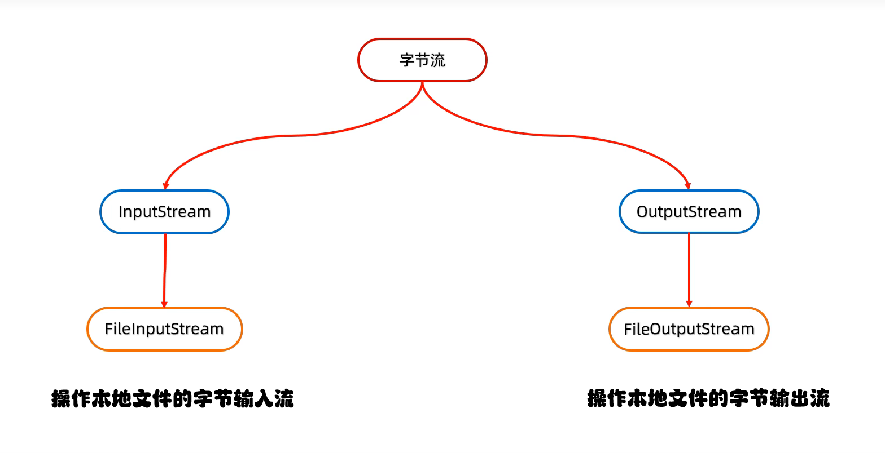

# 常用知识总结

## 1.数据库知识


#### 1.1事务的相关理解


 数据库事务的四大特性通常被称为ACID特性，包括原子性、一致性、隔离性和持久性

这些特性是数据库系统设计的核心原则，确保数据的可靠性和一致性。


原子性(**Atomicity**)

- **定义**：事务中的所有操作要么全部成功，要么全部失败回滚。

- 示例：银行转账操作，如果转账过程中任何一步失败，整个转账操作将回滚，确保账户余额正确

  

**一致性**(Consistency)

- **定义**：事务执行前后，数据库从一个一致性状态变到另一个一致性状态。

- 示例：在转账操作中，无论转账多少次，两个账户的余额之和保持不变

  

隔离性(**Isolation**)

- **定义**：并发执行的事务之间应该互相隔离，一个事务的执行不应该被其他事务干扰。

- 示例：银行柜台处理不同客户的存取款请求，每个客户都认为自己是独占柜台的，不会受到其他客户操作的影响

  

持久性(Durability)

- **定义**：一旦事务提交，其所做的修改将永久保存在系统中，即使系统发生故障也不会丢失。
- **示例**：银行在你完成存款后，即使电力故障，你的存款记录也会安全地保存在账户上


#### 1.2**范式的相关理解**（**三范式**）：


范式(Normal Form)：三范式是数据库设计中的一种规范，它可以帮助我们创建出结构清晰、冗余少、易于维护的数据库。

第一范式（1NF）

- **定义**：确保每个表中的每个字段都是原子的，不可再分的。
- **要求**：每个字段只能包含一个值，不能有重复或多值字段。
- **示例**：
  - **不规范**：一个用户信息表，其中电话号码字段包含了多个号码。
  - 规范：将每个电话号码单独列出，每个用户只有一个电话号码。

第二范式（2NF）

- **定义**：在满足第一范式的基础上，每个非主键字段完全依赖于整个主键，而不是部分依赖于主键的一部分。

- **要求**：表必须满足第一范式。

- **示例**：

  - **不规范**：一个订单表，其中商品名称和单价依赖于商品ID，而不是整个复合主键（订单ID和商品ID）。

  - 规范：将商品信息拆分成一个独立的商品表。

    

第三范式（3NF）

- **定义**：在满足第二范式的基础上，表中的每一个非主键字段都不传递依赖于主键。
- **要求**：表必须满足第二范式。
- **示例**：
  - **不规范**：一个员工信息表，其中部门名称依赖于部门ID，而部门ID依赖于员工ID，即部门名称传递依赖于主键员工ID。
  - 规范：将部门信息拆分成一个独立的部门表。

作用：三范式是可以帮助我们减少数据冗余和提高数据一致性的。


#### 1.3 JDBC的相关知识介绍

JDBC（Java Database Connectivity）是Java语言中用于连接和操作数据库的标准API。在JDBC中，有几个核心的对象，它们各自扮演着不同的角色，共同协作以实现对数据库的访问和操作。以下是JDBC中常用对象的讲解：

1. **DriverManager**

- **作用**：管理一组JDBC驱动程序，并负责将Java应用程序的连接请求与适当的数据库驱动程序匹配。

- 常用方法

  ：

  - `getConnection(String url, String user, String password)`: 获取到数据库的连接。

2. **Connection**

- **作用**：代表与特定数据库的连接（会话）。

- 常用方法

  ：

  - `createStatement()`: 创建一个`Statement`对象。
  - `prepareStatement(String sql)`: 创建一个`PreparedStatement`对象。
  - `prepareCall(String sql)`: 创建一个`CallableStatement`对象。
  - `close()`: 关闭此连接对象。

3. **Statement**

- **作用**：用于执行静态SQL语句并返回其生成的结果。

- 常用方法

  ：

  - `executeQuery(String sql)`: 执行查询操作，返回一个`ResultSet`对象。
  - `executeUpdate(String sql)`: 执行更新操作（如INSERT、UPDATE、DELETE），返回受影响的行数。
  - `execute(String sql)`: 执行任意SQL语句。
  - `close()`: 关闭此`Statement`对象。

4. **PreparedStatement**

- **作用**：预编译的SQL语句对象，用于执行带参数的SQL语句，可以提高性能并防止SQL注入攻击。

- 常用方法

  ：

  - `setXXX(int index, XXX value)`: 设置SQL语句中的参数。
  - `executeQuery()`: 执行查询操作，返回一个`ResultSet`对象。
  - `executeUpdate()`: 执行更新操作，返回受影响的行数。
  - `close()`: 关闭此`PreparedStatement`对象。

5. **CallableStatement**

- **作用**：用于执行数据库中的存储过程。

- 常用方法

  ：

  - `registerOutParameter(int index, int sqlType)`: 注册输出参数。
  - `executeQuery()`: 执行查询操作，返回一个`ResultSet`对象。
  - `executeUpdate()`: 执行更新操作，返回受影响的行数。
  - `getXXX(int index)`: 获取输出参数的值。
  - `close()`: 关闭此`CallableStatement`对象。

6. **ResultSet**

- **作用**：代表数据库查询的结果集。

- 常用方法

  ：

  - `next()`: 移动到结果集中的下一行。
  - `getXXX(int index)`: 获取指定列的值。
  - `getXXX(String columnName)`: 获取指定列名的值。
  - `close()`: 关闭此`ResultSet`对象。

7. **SQLException**

- **作用**：代表在数据库操作过程中发生的异常。

- 常用方法

  ：

  - `getMessage()`: 获取异常的详细信息。
  - `getSQLState()`: 获取SQL状态码。
  - `getErrorCode()`: 获取数据库特定的错误代码。

总结

- **DriverManager** 负责管理驱动程序并建立连接。
- **Connection** 代表与数据库的会话。
- **Statement** 用于执行静态SQL语句。
- **PreparedStatement** 用于执行带参数的预编译SQL语句。
- **CallableStatement** 用于执行存储过程。
- **ResultSet** 用于处理查询结果。
- **SQLException** 用于处理数据库操作中的异常。

这些对象共同构成了JDBC的核心框架，使得Java程序能够方便地与各种数据库进行交互。


## 数据结构知识

## 算法知识

##### 3.1数组引用与创建的区别

例：如果直接使用int[] renum = nums这样子的方式创建数组，对于renum中数组进行修改时会同时修改到nums，而如果想要创建一个和nums同样大小的空数组，可以以 int[] renum = new int[nums.length];这样子的方式进行创建，或者直接进行数组的复制

```java
int[] originalArray = {1, 2, 3, 4, 5};
int[] copiedArray = Arrays.copyOf(originalArray,originalArray.length);
```

## Spring框架相关知识


##### 4.1 IOC和AOP的作用和区别

IoC（Inversion of Control，控制反转）和AOP（Aspect Oriented Programming，面向切面编程）是Spring框架中两个核心概念，它们在软件设计中起到了至关重要的作用。下面将详细介绍它们的作用和区别：

IoC**的作用**

- **解耦**：IoC通过将对象的创建和管理权交给容器，减少了对象之间的直接依赖，从而降低了系统的耦合度。

- 简化开发

  ：开发者不再需要手动创建和管理对象，而是通过容器来获取所需的对象，这使得代码更加简洁，易于维护。

  

AOP**的作用**

- **横切关注点的模块化**：AOP允许将那些影响多个类的公共行为（如日志记录、事务管理、安全控制等）封装到可重用的模块中，这些模块被称为“切面”。

- **提高代码复用性和可维护性**

  ：通过AOP，可以将这些横切关注点从核心业务逻辑中分离出来，减少重复代码，提高代码的可维护性和可扩展性。

  

IoC和AOP的区别

- **目的**：

  - **IoC**：主要目的是实现控制反转，通过容器管理对象的生命周期和依赖关系，从而降低耦合度。

  - **AOP**

    ：主要目的是通过切面编程，将横切关注点从业务逻辑中分离出来，提高代码的模块化和可维护性。

    

- **实现方式**：

  - **IoC**：通常通过依赖注入（DI）来实现，Spring框架提供了多种注入方式，如构造器注入、设值注入等。

  - AOP

    ：基于代理模式实现，Spring AOP支持JDK动态代理和CGLIB动态代理，根据目标类是否有接口来选择合适的代理方式。

- **关注点**：

  - **IoC**：关注对象的创建和依赖关系的管理。
  - **AOP**：关注业务逻辑的横向切分，通过切面实现功能的统一维护。


##### 4.2 Spring Task 是什么？


Spring Task是Spring框架提供的一个功能模块，用于实现定时任务。以下是

Spring Task的主要组件：

1. TaskExecutor：任务执行器，负责执行具体的任务逻辑
2. TaskScheduler：任务调度器，用于配置和管理任务的触发器，如基于时间的触发器或cron表达式
3. Trigger：触发器，定义了任务执行的时间或条件
4. Task：任务，包含具体的任务逻辑

这些组件共同协作，使得Spring Task能够灵活地管理和执行定时任务。


## Redis相关知识:


##### 5.1 Redis为什么快？


1.**纯内存操作**：

Redis利用内存进行数据存储，其操作基于内存读写，由于内存访问速度远超硬盘，使得Redis在处理数据时具有极高的读写速度。特别是对于简单的存取操作，由于线程在内存中执行的时间非常短，主要的时间消耗在于网络I/O，因此Redis在处理大量快速读写请求时表现出卓越的性能。

2.**单线程模型**：

Redis采用单线程模型处理客户端请求，这一设计确保了操作的原子性，避免了多线程环境下的上下文切换和锁竞争问题。这使得Redis在处理命令请求时能够保持高度的确定性和一致性，同时也简化了编程模型，降低了并发控制的复杂性。

IO**多路复用技术**：

Redis通过采用IO多路复用模型，如epoll，能够在一个线程中高效地处理多个客户端连接。单线程轮询监听多个套接字描述符，并将数据库的读、写、连接建立和关闭等操作转化为事件，通过自定义的事件分离器和事件处理器来高效地处理这些事件，从而避免了在等待IO操作时的阻塞。

**高效数据结构**：

Redis的整体设计围绕高效数据结构展开，其中包括但不限于全局哈希表（字典），该结构提供O(1)的平均时间复杂度，并通过rehash操作动态调整哈希桶数量，减少哈希冲突，采用渐进式rehash避免一次性操作过大导致的阻塞。

除此之外，Redis还广泛应用了多种优化过的数据结构，如压缩表（ziplist）用于存储短数据以节省内存，跳跃表（skiplist）用于有序集合提供快速的范围查询，以及其他如列表、集合等数据结构，均针对不同场景进行深度优化，确保了在读取和操作数据时的高性能。

## Nginx的相关 知识

## 力扣题目

### 数据库题目

##### 550.游戏玩法分析 IV

Table: `Activity`

```
+--------------+---------+
| Column Name  | Type    |
+--------------+---------+
| player_id    | int     |
| device_id    | int     |
| event_date   | date    |
| games_played | int     |
+--------------+---------+
（player_id，event_date）是此表的主键（具有唯一值的列的组合）。
这张表显示了某些游戏的玩家的活动情况。
每一行是一个玩家的记录，他在某一天使用某个设备注销之前登录并玩了很多游戏（可能是 0）。
```

 

编写解决方案，报告在首次登录的第二天再次登录的玩家的 **比率**，**四舍五入到小数点后两位**。换句话说，你需要计算从首次登录日期开始至少连续两天登录的玩家的数量，然后除以玩家总数。

结果格式如下所示：

 

**示例 1：**

```
输入：
Activity table:
+-----------+-----------+------------+--------------+
| player_id | device_id | event_date | games_played |
+-----------+-----------+------------+--------------+
| 1         | 2         | 2016-03-01 | 5            |
| 1         | 2         | 2016-03-02 | 6            |
| 2         | 3         | 2017-06-25 | 1            |
| 3         | 1         | 2016-03-02 | 0            |
| 3         | 4         | 2018-07-03 | 5            |
+-----------+-----------+------------+--------------+
输出：
+-----------+
| fraction  |
+-----------+
| 0.33      |
+-----------+
解释：
只有 ID 为 1 的玩家在第一天登录后才重新登录，所以答案是 1/3 = 0.33
```

```sql
-- 创建一个名为first_login的临时表，其中包含每个玩家的首次登录日期
WITH first_login AS (
    SELECT player_id, MIN(event_date) AS first_date
    FROM Activity
    GROUP BY player_id
),

-- 创建一个名为second_login的临时表，其中包含在首次登录的第二天再次登录的玩家
second_login AS (
    SELECT a.player_id
    FROM Activity a
    JOIN first_login fl ON a.player_id = fl.player_id
    WHERE a.event_date = DATE_ADD(fl.first_date, INTERVAL 1 DAY)
)

-- 计算在首次登录的第二天再次登录的玩家的数量，并除以总玩家数量，得到所需的比例
SELECT ROUND(COUNT(DISTINCT sl.player_id) / COUNT(DISTINCT fl.player_id), 2) AS fraction
FROM first_login fl
LEFT JOIN second_login sl ON fl.player_id = sl.player_id;
```


### 算法题目

##### 1365.有多少小于当前数字的数字（简）

给你一个数组 `nums`，对于其中每个元素 `nums[i]`，请你统计数组中比它小的所有数字的数目。

换而言之，对于每个 `nums[i]` 你必须计算出有效的 `j` 的数量，其中 `j` 满足 `j != i` **且** `nums[j] < nums[i]` 。

以数组形式返回答案。

 

**示例 1：**

```
输入：nums = [8,1,2,2,3]
输出：[4,0,1,1,3]
解释： 
对于 nums[0]=8 存在四个比它小的数字：（1，2，2 和 3）。 
对于 nums[1]=1 不存在比它小的数字。
对于 nums[2]=2 存在一个比它小的数字：（1）。 
对于 nums[3]=2 存在一个比它小的数字：（1）。 
对于 nums[4]=3 存在三个比它小的数字：（1，2 和 2）。
```

**示例 2：**

```
输入：nums = [6,5,4,8]
输出：[2,1,0,3]
```

**示例 3：**

```
输入：nums = [7,7,7,7]
输出：[0,0,0,0]
```

 

**提示：**

- `2 <= nums.length <= 500`
- `0 <= nums[i] <= 100`


题解：

```java
class Solution {

  public int[] smallerNumbersThanCurrent(int[] nums) {

​    int[] renum = new int[nums.length];

​    for (int i = 0; i < nums.length; i++) {

​      int num = 0;

​      for (int j = 0; j < nums.length; j++) {

​        if (nums[i] > nums[j]) {

​          num++;

​        }

​      }

​      renum[i] = num;

​    }

​    return renum;

  }

}
```


##### [49. 字母异位词分组](https://leetcode.cn/problems/group-anagrams/)（中）

给你一个字符串数组，请你将 **字母异位词** 组合在一起。可以按任意顺序返回结果列表。

**字母异位词** 是由重新排列源单词的所有字母得到的一个新单词。

 

**示例 1:**

```
输入: strs = ["eat", "tea", "tan", "ate", "nat", "bat"]
输出: [["bat"],["nat","tan"],["ate","eat","tea"]]
```

**示例 2:**

```
输入: strs = [""]
输出: [[""]]
```

**示例 3:**

```
输入: strs = ["a"]
输出: [["a"]]
```

 

**提示：**

- `1 <= strs.length <= 104`
- `0 <= strs[i].length <= 100`
- `strs[i]` 仅包含小写字母


题解:

```java
class Solution {
    public List<List<String>> groupAnagrams(String[] strs) {
        Map<String,List<String>> map = new HashMap<String,List<String>>();
        for(String str : strs){
            char[] array = str.toCharArray();
            Arrays.sort(array);
            String key = new String(array);
            //getOrDefault方法表示当map中存在有该key值对应的ArrayList集合时，则返回该key对应的ArrayList集合，如果没有，则返回一个空的集合赋值给list。
            List<String>list = map.getOrDefault(key,new ArrayList<String>());
            list.add(str);
            map.put(key,list);
        }
        //返回map中所有的数组的值
      return new ArrayList<List<String>>(map.values());
    }
}
```


##### [128. 最长连续序列](https://leetcode.cn/problems/longest-consecutive-sequence/)（中）

给定一个未排序的整数数组 `nums` ，找出数字连续的最长序列（不要求序列元素在原数组中连续）的长度。

请你设计并实现时间复杂度为 `O(n)` 的算法解决此问题。

 

**示例 1：**

```
输入：nums = [100,4,200,1,3,2]
输出：4
解释：最长数字连续序列是 [1, 2, 3, 4]。它的长度为 4。
```

**示例 2：**

```
输入：nums = [0,3,7,2,5,8,4,6,0,1]
输出：9
```

 

**提示：**

- `0 <= nums.length <= 105`
- `-109 <= nums[i] <= 109`


题解：

```java
class Solution {
    public int longestConsecutive(int[] nums) {
        //如果传入的数组为空或者长度为0，则返回0
       if(nums == null || nums.length == 0){
         return 0;
       }

        //将数组的值逐一放入HashSet方法中，该方法的特点是不允许集合中包含有重复的元素，可以包含null值，但不能保证顺序，以及相关记录的插入顺序，常用有add，size，remove，isEmpty，clear，iterator,contains方法。
       Set<Integer> numSet = new HashSet<>();
       for(int num : nums){
        numSet.add(num);
       }

        //定义返回的最大值
       int maxLength = 1;

       for(int num : nums){
        //如果当前num不存在上一个节点是num-1，则可知其可为顺序头
        if(!numSet.contains(num-1)){
            int length = 1;
            int currentNum = num;
            //使用while循环不断遍历当前num值是否在numSet存在，若存在，则加1，且更新num值
            while(numSet.contains(currentNum+1)){
                length++;
                currentNum++;
            }
            //比较每一次的顺序表的长度和所记录的最大值，及时更新最大值
            maxLength = Math.max(maxLength,length);
        }
       }
      //返回顺序的最大值
       return maxLength;
    }
}
```


##### [283. 移动零](https://leetcode.cn/problems/move-zeroes/)

给定一个数组 `nums`，编写一个函数将所有 `0` 移动到数组的末尾，同时保持非零元素的相对顺序。

**请注意** ，必须在不复制数组的情况下原地对数组进行操作。

 

**示例 1:**

```
输入: nums = [0,1,0,3,12]
输出: [1,3,12,0,0]
```

**示例 2:**

```
输入: nums = [0]
输出: [0]
```

 

**提示**:

- `1 <= nums.length <= 104`
- `-231 <= nums[i] <= 231 - 1`


题解（自己独立）

```java
class Solution {
    public void moveZeroes(int[] nums) {
        int k1 = 0;
        int k2 = 0;
        // 通过新建一个数组用于记录非零和不非零的情况将其赋值进去
        int[] renum = new int[nums.length];

        for(int i=0;i<=nums.length - 1;i++){
            // 不为0的情况
            if(nums[i]!=0){
                renum[k2] = nums[i];
                k2 ++; 
            // 为0的情况
            }else{
                renum[renum.length - k1 -1] = nums[i];
                k1++; 
            }
        }
           // 将renum数组的内容复制回nums数组
        for (int i = 0; i < nums.length; i++) {
            nums[i] = renum[i];
        }
    }
}
```


题解（参考别人的，优化：不需要创建新的数组，减少内存的消耗）

```java
class Solution {
    public void moveZeroes(int[] nums) {
        int nonZeroIndex = 0;

        // 遍历数组，将非零元素移到数组前面
        for (int i = 0; i < nums.length; i++) {
            if (nums[i] != 0) {
                //先赋值，再➕➕
                nums[nonZero[nonZeroIndex++] = nums[i];
            }
        }

        // 将剩余的位置填充为零
        for (int i = nonZeroIndex; i < nums.length; i++) {
            nums[i] = 0;
        }
    }
}
```


##### [11. 盛最多水的容器](https://leetcode.cn/problems/container-with-most-water/)（中）

给定一个长度为 `n` 的整数数组 `height` 。有 `n` 条垂线，第 `i` 条线的两个端点是 `(i, 0)` 和 `(i, height[i])` 。

找出其中的两条线，使得它们与 `x` 轴共同构成的容器可以容纳最多的水。

返回容器可以储存的最大水量。

**说明：**你不能倾斜容器。

 

**示例 1：**


```
输入：[1,8,6,2,5,4,8,3,7]
输出：49 
解释：图中垂直线代表输入数组 [1,8,6,2,5,4,8,3,7]。在此情况下，容器能够容纳水（表示为蓝色部分）的最大值为 49。
```

**示例 2：**

```
输入：height = [1,1]
输出：1
```

 

**提示：**

- `n == height.length`
- `2 <= n <= 105`
- `0 <= height[i] <= 104`


题解（自己独立）：

```java
class Solution {
    public int maxArea(int[] height) {
       int l = 0;//定义最优左指针
       int r = height.length - 1;//定义最优右指针
       int l1 = 0;//定义变化左指针
       int r1 = height.length -1;//变化右指针
       int s = (r-l)*Math.min(height[l],height[r]);//初始面积

       while(l1<r1){
        int s1 = (r1 - l1)*Math.min(height[l1],height[r1]);
        if(height[l1] < height[r1]){                 
          if(s1 > s){
            s =s1;
            l = l1;
            r=r1;                      
          }
          l1++;  
       }else{
         if(s1 > s){
            s=s1;
            r = r1;
            l=l1;
            r1--;
          }
          r1--;         
       }     
       }
        return s;
    }
}
```


[42. 接雨水](https://leetcode.cn/problems/trapping-rain-water/)(困)


给定 `n` 个非负整数表示每个宽度为 `1` 的柱子的高度图，计算按此排列的柱子，下雨之后能接多少雨水。

 

**示例 1：**


```
输入：height = [0,1,0,2,1,0,1,3,2,1,2,1]
输出：6
解释：上面是由数组 [0,1,0,2,1,0,1,3,2,1,2,1] 表示的高度图，在这种情况下，可以接 6 个单位的雨水（蓝色部分表示雨水）。 
```

**示例 2：**

```
输入：height = [4,2,0,3,2,5]
输出：9
```


单调栈解法：

```java
class Solution {
    public int trap(int[] height) {
         if (height == null || height.length == 0) {
            return 0;
        }
        
        Stack<Integer> stack = new Stack<>();
        int trappedWater = 0;
        
        for (int i = 0; i < height.length; i++) {
            // 当前高度大于栈顶索引对应的高度时，说明可以积水
            while (!stack.isEmpty() && height[i] > height[stack.peek()]) {
                int topIndex = stack.pop();
                if (stack.isEmpty()) {
                    break; // 栈为空，没有左边的墙可以形成积水
                }
                
                // 计算当前位置的积水量
                int distance = i - stack.peek() - 1;
                int boundedHeight = Math.min(height[i], height[stack.peek()]) - height[topIndex];
                trappedWater += distance * boundedHeight;
            }
            
            // 将当前索引入栈
            stack.push(i);
        }
        
        return trappedWater;
 }
}
```

 

双指针解法：

```java
public class Solution {
    public int trap(int[] height) {
        if (height == null || height.length == 0) {
            return 0;
        }
        
        int left = 0;
        int right = height.length - 1;
        int leftMax = 0;
        int rightMax = 0;
        int trappedWater = 0;
        
        while (left < right) {
            if (height[left] < height[right]) {
                // 如果左边的柱子比右边的矮，那么左边的柱子决定了当前位置能积累的雨水量
                if (height[left] >= leftMax) {
                    // 更新左边最大高度
                    leftMax = height[left];
                } else {
                    // 当前位置的雨水量
                    trappedWater += leftMax - height[left];
                }
                left++;
            } else {
                // 如果右边的柱子比左边的矮，那么右边的柱子决定了当前位置能积累的雨水量
                if (height[right] >= rightMax) {
                    // 更新右边最大高度
                    rightMax = height[right];
                } else {
                    // 当前位置的雨水量
                    trappedWater += rightMax - height[right];
                }
                right--;
            }
        }
        
        return trappedWater;
    }
    
    public static void main(String[] args) {
        Solution solution = new Solution();
        int[] height1 = {0,1,0,2,1,0,1,3,2,1,2,1};
        System.out.println(solution.trap(height1)); // 应该输出 6
        
        int[] height2 = {4,2,0,3,2,5};
        System.out.println(solution.trap(height2)); // 应该输出 9
    }
}
```


##### [438. 找到字符串中所有字母异位词](https://leetcode.cn/problems/find-all-anagrams-in-a-string/)(中)


给定两个字符串 `s` 和 `p`，找到 `s` 中所有 `p` 的 

**异位词**

 的子串，返回这些子串的起始索引。不考虑答案输出的顺序。


**示例 1:**

```
输入: s = "cbaebabacd", p = "abc"
输出: [0,6]
解释:
起始索引等于 0 的子串是 "cba", 它是 "abc" 的异位词。
起始索引等于 6 的子串是 "bac", 它是 "abc" 的异位词。
```

 **示例 2:**

```
输入: s = "abab", p = "ab"
输出: [0,1,2]
解释:
起始索引等于 0 的子串是 "ab", 它是 "ab" 的异位词。
起始索引等于 1 的子串是 "ba", 它是 "ab" 的异位词。
起始索引等于 2 的子串是 "ab", 它是 "ab" 的异位词。
```

 

**提示:**

- `1 <= s.length, p.length <= 3 * 104`
- `s` 和 `p` 仅包含小写字母


题解（自己独立，暴力破解 1900ms以上）

```java
class Solution {
    public List<Integer> findAnagrams(String s, String p) {   
       // 定义传入p的长度 
       int l = p.length();
        // 创建一个用于返回的数组
       List<Integer> rei = new ArrayList<>();
        // 判断传入字符串和所需比较串大小是否吗满足可返回条件 
       if (s == null || p == null || s.length() < p.length()) {
            return rei;
        }
        //将比较字符串字符化
        char[] p1 = p.toCharArray();
        //将其进行排序
        Arrays.sort(p1);
        //字符串化
        String pend = new String(p1);
        //进行for循环不断比较是否一致，一致则加入数组进行返回
        for(int i=0;i<=s.length()-l;i++){
            String res = s.substring(i,i+l);
            char[] array = res.toCharArray();
            Arrays.sort(array);
            String key = new String(array);
            if(key.equals(pend)){
               rei.add(i);
            }
        }
        return rei;
    }
}
```


别人的题解:（430ms，滑动窗口）

```java
public List<Integer> findAnagrams(String s, String p) {
    List<Integer> resultList = new ArrayList<>();

    // 计算字符串p中各元素的出现次数
    int[] pFreq = new int[26];
    for(int i = 0; i < p.length(); i++) {
        pFreq[p.charAt(i)-'a']++;
    }

    // 窗口区间为[start,end]
    int start = 0, end = -1;
    while (start < s.length()) {
        // 还有剩余元素未考察，且窗口内字符串长度小于字符串p的长度
        // 则扩大窗口右侧边界
        if (end+1 < s.length() && end-start+1 <p.length()) {
            end++;
        }else {
            // 右侧边界不能继续扩大或窗口内字符串长度等于字符串p的长度
            // 则缩小左侧边界
            start++;
        }

        // 当窗口内字符串长度等于字符串p的长度时，则判断其是不是字符串p的字母异位词子串
        if (end-start+1 == p.length() && isAnagrams(s.substring(start,end+1), pFreq)) {
            resultList.add(start);
        }
    }
    return resultList;
}

// 判断当前子串是不是字符串p的字母异位词
private boolean isAnagrams(String window, int[] pFreq) {
    // 计算窗口内字符串各元素的出现次数
    int[] windowFreq = new int[26];
    for(int i = 0; i < window.length(); i++) {
        windowFreq[window.charAt(i)-'a']++;
    }

    // 比较窗口内各元素的出现次数和字符串p中各元素的出现次数是否一样
    // 如果都一样，则说明窗口内的字符串是字符串p的字母异位词子串
    // 如果不一样，则说明不是其子串
    for(int j = 0; j < 26; j++) {
        if (windowFreq[j] != pFreq[j]) {
            return false;
        }
    }
    return true;
}

```


##### [560. 和为 K 的子数组](https://leetcode.cn/problems/subarray-sum-equals-k/)（中）

给你一个整数数组 `nums` 和一个整数 `k` ，请你统计并返回 *该数组中和为 `k` 的子数组的个数* 。

子数组是数组中元素的连续非空序列。

 

**示例 1：**

```
输入：nums = [1,1,1], k = 2
输出：2
```

**示例 2：**

```
输入：nums = [1,2,3], k = 3
输出：2
```

 

题解：（滑动窗口+HashMap）

```java
//思路是减掉k看看有没有对应的前缀，有的话就代表k在某一部分有该数组
class Solution {
    public int subarraySum(int[] nums, int k) {
       Map<Integer,Integer> map = new HashMap<>();
       map.put(0,1);
       int sum = 0 , ret = 0;

       for(int i = 0;i< nums.length;++i) {
        sum  = sum + nums[i];
        if(map.containsKey(sum-k))
            ret  = ret+map.get(sum-k);
            map.put(sum,map.getOrDefault(sum,0)+1);
       }
       return ret;
    }
}
```


[239. 滑动窗口最大值](https://leetcode.cn/problems/sliding-window-maximum/)（困）

给你一个整数数组 `nums`，有一个大小为 `k` 的滑动窗口从数组的最左侧移动到数组的最右侧。你只可以看到在滑动窗口内的 `k` 个数字。滑动窗口每次只向右移动一位。

返回 *滑动窗口中的最大值* 。

 

**示例 1：**

```
输入：nums = [1,3,-1,-3,5,3,6,7], k = 3
输出：[3,3,5,5,6,7]
解释：
滑动窗口的位置                最大值
---------------               -----
[1  3  -1] -3  5  3  6  7       3
 1 [3  -1  -3] 5  3  6  7       3
 1  3 [-1  -3  5] 3  6  7       5
 1  3  -1 [-3  5  3] 6  7       5
 1  3  -1  -3 [5  3  6] 7       6
 1  3  -1  -3  5 [3  6  7]      7
```

**示例 2：**

```
输入：nums = [1], k = 1
输出：[1]
```

 

**提示：**

- `1 <= nums.length <= 105`
- `-104 <= nums[i] <= 104`
- `1 <= k <= nums.length`


```java
//使用单调队列处理解决这个问题
class Solution {
    public int[] maxSlidingWindow(int[] nums, int k) {
         if (nums == null || nums.length == 0 || k <= 0) {
            return new int[0];
        }

        int n = nums.length;
        int[] result = new int[n - k + 1];
        int ri = 0; // 结果数组的索引

        // 使用双端队列来维护单调递减队列
        Deque<Integer> deque = new ArrayDeque<>();

        for (int i = 0; i < n; i++) {
            // 移除队列中不在当前窗口的元素
            while (!deque.isEmpty() && deque.peek() < i - k + 1) {
                deque.poll();
            }

            // 移除队列中所有小于当前元素的值
            while (!deque.isEmpty() && nums[deque.peekLast()] < nums[i]) {
                deque.pollLast();
            }

            // 将当前元素的下标加入队列
            deque.offer(i);

            // 当窗口完全覆盖时，记录当前窗口的最大值
            if (i >= k - 1) {
                result[ri++] = nums[deque.peek()];
            }
        }
        return result;
    }
}
```


##### [3. 无重复字符的最长子串](https://leetcode.cn/problems/longest-substring-without-repeating-characters/)(中)

给定一个字符串 `s` ，请你找出其中不含有重复字符的 **最长** 

**子串**

 的长度。


 

**示例 1:**

```
输入: s = "abcabcbb"
输出: 3 
解释: 因为无重复字符的最长子串是 "abc"，所以其长度为 3。
```

**示例 2:**

```
输入: s = "bbbbb"
输出: 1
解释: 因为无重复字符的最长子串是 "b"，所以其长度为 1。
```

**示例 3:**

```
输入: s = "pwwkew"
输出: 3
解释: 因为无重复字符的最长子串是 "wke"，所以其长度为 3。
     请注意，你的答案必须是 子串 的长度，"pwke" 是一个子序列，不是子串。
```

 

**提示：**

- `0 <= s.length <= 5 * 104`
- `s` 由英文字母、数字、符号和空格组成


题解（滑动窗口）

```java
class Solution {
    public int lengthOfLongestSubstring(String s) {
         Map<Character, Integer> map = new HashMap<>();
        int maxLength = 0;
        int start = 0;
        for (int i = 0; i < s.length(); i++) {
            char c = s.charAt(i);
            if (map.containsKey(c)) {
                // 如果字符已经存在于map中，更新start指针到重复字符的下一个位置
                start = Math.max(start, map.get(c) + 1);
            }
            // 更新当前字符的最新位置
            map.put(c, i);
            // 更新最大长度
            maxLength = Math.max(maxLength, i - start + 1);
        }
        return maxLength;
  }
}
```


##### [76. 最小覆盖子串](https://leetcode.cn/problems/minimum-window-substring/)（难）

给你一个字符串 `s` 、一个字符串 `t` 。返回 `s` 中涵盖 `t` 所有字符的最小子串。如果 `s` 中不存在涵盖 `t` 所有字符的子串，则返回空字符串 `""` 。

 

**注意：**

- 对于 `t` 中重复字符，我们寻找的子字符串中该字符数量必须不少于 `t` 中该字符数量。
- 如果 `s` 中存在这样的子串，我们保证它是唯一的答案。

 

**示例 1：**

```
输入：s = "ADOBECODEBANC", t = "ABC"
输出："BANC"
解释：最小覆盖子串 "BANC" 包含来自字符串 t 的 'A'、'B' 和 'C'。
```

**示例 2：**

```
输入：s = "a", t = "a"
输出："a"
解释：整个字符串 s 是最小覆盖子串。
```

**示例 3:**

```
输入: s = "a", t = "aa"
输出: ""
解释: t 中两个字符 'a' 均应包含在 s 的子串中，
因此没有符合条件的子字符串，返回空字符串。
```

 

**提示：**

- `m == s.length`
- `n == t.length`
- `1 <= m, n <= 105`
- `s` 和 `t` 由英文字母组成


解法：

```java
public class MinWindow {
    public static String minWindow(String s, String t) {
        // 用于记录t中每个字符出现的次数
        // 用于记录窗口中每个字符出现的次数
        Map<Character, Integer> window = new HashMap<>();
        for (char c : t.toCharArray()) {
            need.put(c, need.getOrDefault(c, 0) + 1);
        }
        int left = 0;
        int right = 0;
        int valid = 0;
        // 记录最小子串的起始位置和长度，初始化为较大值
        int start = 0;
        int len = Integer.MAX_VALUE;
        while (right < s.length()) {
            // 将要移入窗口的字符
            char c = s.charAt(right);
            right++;
            // 如果该字符是t中需要关注的字符，更新窗口中对应字符的数量
            if (need.containsKey(c)) {
                window.put(c, window.getOrDefault(c, 0) + 1);
                if (window.get(c).equals(need.get(c))) {
                    valid++;
                }
            }
            // 当窗口中已经包含了t中所有字符时，尝试收缩窗口
            while (valid == need.size()) {
                // 更新最小子串的长度和起始位置
                if (right - left < len) {
                    start = left;
                    len = right - left;
                }
                char d = s.charAt(left);
                left++;
                // 如果移除的字符是t中需要关注的字符，更新窗口相关状态
                if (need.containsKey(d)) {
                    if (window.get(d).equals(need.get(d))) {
                        valid--;
                    }
                    window.put(d, window.get(d) - 1);
                }
            }
        }
        return len == Integer.MAX_VALUE? "" : s.substring(start, start + len);
    }
```


##### [56. 合并区间](https://leetcode.cn/problems/merge-intervals/)（中）

以数组 `intervals` 表示若干个区间的集合，其中单个区间为 `intervals[i] = [starti, endi]` 。请你合并所有重叠的区间，并返回 *一个不重叠的区间数组，该数组需恰好覆盖输入中的所有区间* 。

 

**示例 1：**

```
输入：intervals = [[1,3],[2,6],[8,10],[15,18]]
输出：[[1,6],[8,10],[15,18]]
解释：区间 [1,3] 和 [2,6] 重叠, 将它们合并为 [1,6].
```

**示例 2：**

```
输入：intervals = [[1,4],[4,5]]
输出：[[1,5]]
解释：区间 [1,4] 和 [4,5] 可被视为重叠区间。
```

 

**提示：**

- `1 <= intervals.length <= 104`
- `intervals[i].length == 2`
- `0 <= starti <= endi <= 104`

解法：

```java
class Solution {
    /**
     * 合并所有重叠的区间，返回一个不重叠的区间数组
     * @param intervals 输入的区间数组，每个区间是形如 [start, end] 的数组
     * @return 合并后的不重叠区间数组
     */
    public int[][] merge(int[][] intervals) {
        // 边界检查：输入为空或长度为0时，直接返回空数组
        if (intervals == null || intervals.length == 0) {
            return new int[0][];
        }

        // 关键步骤1：按区间的起始点升序排序
        // 排序后只需比较相邻区间即可判断是否重叠
        Arrays.sort(intervals, (a, b) -> Integer.compare(a[0], b[0]));

        // 存储合并后的结果（动态数组方便操作）
        List<int[]> merged = new ArrayList<>();
        // 将第一个区间作为初始区间加入结果列表
        merged.add(intervals[0]);

        // 关键步骤2：遍历排序后的所有区间
        for (int i = 1; i < intervals.length; i++) {
            int[] current = intervals[i];    // 当前区间
            int[] last = merged.get(merged.size() - 1); // 已合并列表的最后一个区间

            // 情况1：当前区间与已合并的最后一个区间重叠 → 合并
            if (current[0] <= last[1]) { 
                // 合并后的结束点取两者较大值（例如 [1,3] 和 [2,6] → [1,6]）
                last[1] = Math.max(last[1], current[1]);
            } 
            // 情况2：不重叠 → 将当前区间加入结果列表
            else { 
                merged.add(current);
            }
        }

        // 将List<int[]>转换为int[][]返回
        // new int[merged.size()][] 用于指定返回数组的类型和长度
        return merged.toArray(new int[merged.size()][]);
    }
}
```


##### [238. 除自身以外数组的乘积](https://leetcode.cn/problems/product-of-array-except-self/)（中等）


给你一个整数数组 `nums`，返回 数组 `answer` ，其中 `answer[i]` 等于 `nums` 中除 `nums[i]` 之外其余各元素的乘积 。

题目数据 **保证** 数组 `nums`之中任意元素的全部前缀元素和后缀的乘积都在 **32 位** 整数范围内。

请 **不要使用除法，**且在 `O(n)` 时间复杂度内完成此题。

 

**示例 1:**

```
输入: nums = [1,2,3,4]
输出: [24,12,8,6]
```

**示例 2:**

```
输入: nums = [-1,1,0,-3,3]
输出: [0,0,9,0,0]
```


##### [41. 缺失的第一个正数](https://leetcode.cn/problems/first-missing-positive/)（困难）


给你一个未排序的整数数组 `nums` ，请你找出其中没有出现的最小的正整数。

请你实现时间复杂度为 `O(n)` 并且只使用常数级别额外空间的解决方案。

 

**示例 1：**

```
输入：nums = [1,2,0]
输出：3
解释：范围 [1,2] 中的数字都在数组中。
```

**示例 2：**

```
输入：nums = [3,4,-1,1]
输出：2
解释：1 在数组中，但 2 没有。
```

**示例 3：**

```
输入：nums = [7,8,9,11,12]
输出：1
解释：最小的正数 1 没有出现。
```

 

**提示：**

- `1 <= nums.length <= 105`
- `-231 <= nums[i] <= 231 - 1`


解法：

```java
class Solution {
    public int firstMissingPositive(int[] nums) {
        int n = nums.length;
        // 第一次遍历数组，将每个正整数放到其正确的位置上
        for (int i = 0; i < n; i++) {
            // 当前元素在1到n范围内，且未在正确位置时，持续交换
            while (nums[i] >= 1 && nums[i] <= n && nums[nums[i] - 1] != nums[i]) {
                swap(nums, i, nums[i] - 1); // 将nums[i]交换到索引nums[i]-1的位置
            }
        }
        
        // 第二次遍历，找到第一个不符合条件的位置，即缺失的最小正整数
        for (int i = 0; i < n; i++) {
            if (nums[i] != i + 1) {
                return i + 1;
            }
        }
        // 如果所有位置都正确，则缺失的是n+1
        return n + 1;
    }
    
    // 交换数组中两个元素的位置
    private void swap(int[] nums, int i, int j) {
        int temp = nums[i];
        nums[i] = nums[j];
        nums[j] = temp;
    }
}
```


##### [54. 螺旋矩阵](https://leetcode.cn/problems/spiral-matrix/)（中等）


给你一个 `m` 行 `n` 列的矩阵 `matrix` ，请按照 **顺时针螺旋顺序** ，返回矩阵中的所有元素。

 

**示例 1：**


```
输入：matrix = [[1,2,3],[4,5,6],[7,8,9]]
输出：[1,2,3,6,9,8,7,4,5]
```

**示例 2：**


```
输入：matrix = [[1,2,3,4],[5,6,7,8],[9,10,11,12]]
输出：[1,2,3,4,8,12,11,10,9,5,6,7]
```


解法：

```java
import java.util.ArrayList;
import java.util.List;

public class Solution {
    public List<Integer> spiralOrder(int[][] matrix) {
        List<Integer> res = new ArrayList<>();
        if (matrix == null || matrix.length == 0 || matrix[0].length == 0) {
            return res;
        }
        
        int m = matrix.length;
        int n = matrix[0].length;
        int top = 0, bottom = m - 1, left = 0, right = n - 1;
        
        while (top <= bottom && left <= right) {
            // 处理上边，从左到右
            for (int i = left; i <= right; i++) {
                res.add(matrix[top][i]);
            }
            top++;
            
            // 处理右边，从上到下
            if (top > bottom) {
                break;
            }
            for (int i = top; i <= bottom; i++) {
                res.add(matrix[i][right]);
            }
            right--;
            
            // 处理下边，从右到左
            if (left > right) {
                break;
            }
            for (int i = right; i >= left; i--) {
                res.add(matrix[bottom][i]);
            }
            bottom--;
            
            // 处理左边，从下到上
            if (top > bottom) {
                break;
            }
            for (int i = bottom; i >= top; i--) {
                res.add(matrix[i][left]);
            }
            left++;
        }
        
        return res;
    }
}
```


##### [48. 旋转图像](https://leetcode.cn/problems/rotate-image/)（中等）


给定一个 *n* × *n* 的二维矩阵 `matrix` 表示一个图像。请你将图像顺时针旋转 90 度。

你必须在**[ 原地](https://baike.baidu.com/item/原地算法)** 旋转图像，这意味着你需要直接修改输入的二维矩阵。**请不要** 使用另一个矩阵来旋转图像。

 

**示例 1：**


```
输入：matrix = [[1,2,3],[4,5,6],[7,8,9]]
输出：[[7,4,1],[8,5,2],[9,6,3]]
```

**示例 2：**


```
输入：matrix = [[5,1,9,11],[2,4,8,10],[13,3,6,7],[15,14,12,16]]
输出：[[15,13,2,5],[14,3,4,1],[12,6,8,9],[16,7,10,11]]
```


解法：

```java
class Solution {
    public void rotate(int[][] matrix) {
        int n = matrix.length;
        
        // 1. 转置矩阵（沿主对角线翻转）
        for(int i = 0; i < n; i++) {
            for(int j = i + 1; j < n; j++) { // 修复条件：j < n
                // 交换 matrix[i][j] 和 matrix[j][i]
                int temp = matrix[i][j];
                matrix[i][j] = matrix[j][i];
                matrix[j][i] = temp; // 修复赋值
            }
        }
        
        // 2. 反转每一行（水平镜像翻转）
        for(int i = 0; i < n; i++) {
            int left = 0;
            int right = n - 1;
            while(left < right) {
                int temp = matrix[i][left];
                matrix[i][left] = matrix[i][right];
                matrix[i][right] = temp;
                left++;
                right--;
            }
        }
    }
}
```


##### [160. 相交链表](https://leetcode.cn/problems/intersection-of-two-linked-lists/)（简单）

给你两个单链表的头节点 `headA` 和 `headB` ，请你找出并返回两个单链表相交的起始节点。如果两个链表不存在相交节点，返回 `null` 。

图示两个链表在节点 `c1` 开始相交**：**

[](https://assets.leetcode-cn.com/aliyun-lc-upload/uploads/2018/12/14/160_statement.png)

题目数据 **保证** 整个链式结构中不存在环。

**注意**，函数返回结果后，链表必须 **保持其原始结构** 。

**自定义评测：**

**评测系统** 的输入如下（你设计的程序 **不适用** 此输入）：

- `intersectVal` - 相交的起始节点的值。如果不存在相交节点，这一值为 `0`
- `listA` - 第一个链表
- `listB` - 第二个链表
- `skipA` - 在 `listA` 中（从头节点开始）跳到交叉节点的节点数
- `skipB` - 在 `listB` 中（从头节点开始）跳到交叉节点的节点数

评测系统将根据这些输入创建链式数据结构，并将两个头节点 `headA` 和 `headB` 传递给你的程序。如果程序能够正确返回相交节点，那么你的解决方案将被 **视作正确答案** 。

 

**示例 1：**

[](https://assets.leetcode.com/uploads/2018/12/13/160_example_1.png)

```
输入：intersectVal = 8, listA = [4,1,8,4,5], listB = [5,6,1,8,4,5], skipA = 2, skipB = 3
输出：Intersected at '8'
解释：相交节点的值为 8 （注意，如果两个链表相交则不能为 0）。
从各自的表头开始算起，链表 A 为 [4,1,8,4,5]，链表 B 为 [5,6,1,8,4,5]。
在 A 中，相交节点前有 2 个节点；在 B 中，相交节点前有 3 个节点。
— 请注意相交节点的值不为 1，因为在链表 A 和链表 B 之中值为 1 的节点 (A 中第二个节点和 B 中第三个节点) 是不同的节点。换句话说，它们在内存中指向两个不同的位置，而链表 A 和链表 B 中值为 8 的节点 (A 中第三个节点，B 中第四个节点) 在内存中指向相同的位置。
```

 

**示例 2：**

[](https://assets.leetcode.com/uploads/2018/12/13/160_example_2.png)

```
输入：intersectVal = 2, listA = [1,9,1,2,4], listB = [3,2,4], skipA = 3, skipB = 1
输出：Intersected at '2'
解释：相交节点的值为 2 （注意，如果两个链表相交则不能为 0）。
从各自的表头开始算起，链表 A 为 [1,9,1,2,4]，链表 B 为 [3,2,4]。
在 A 中，相交节点前有 3 个节点；在 B 中，相交节点前有 1 个节点。
```

**示例 3：**

[](https://assets.leetcode.com/uploads/2018/12/13/160_example_3.png)

```
输入：intersectVal = 0, listA = [2,6,4], listB = [1,5], skipA = 3, skipB = 2
输出：No intersection
解释：从各自的表头开始算起，链表 A 为 [2,6,4]，链表 B 为 [1,5]。
由于这两个链表不相交，所以 intersectVal 必须为 0，而 skipA 和 skipB 可以是任意值。
```


解法：

```java
/**
 * 单链表节点定义（题目已给出，此处为示意）
 * class ListNode {
 *     int val;
 *     ListNode next;
 *     ListNode(int x) { val = x; }
 * }
 */

public class Solution {
    /**
     * 查找两个单链表的相交起始节点
     * @param headA 链表A的头节点
     * @param headB 链表B的头节点
     * @return 相交节点（如果存在），否则返回 null
     */
    public ListNode getIntersectionNode(ListNode headA, ListNode headB) {
        // 处理边界情况：任一链表为空时不可能相交
        if (headA == null || headB == null) {
            return null;
        }

        // 初始化两个遍历指针
        ListNode pA = headA; // 指针A初始指向链表A头节点
        ListNode pB = headB; // 指针B初始指向链表B头节点

        // 关键：当两个指针不指向同一节点时继续遍历
        // 终止条件有两种可能：
        // 1. 找到相交节点（pA == pB 且不为null）
        // 2. 两个指针同时走到null（说明不相交）
        while (pA != pB) {
            // 指针A移动规则：
            // - 如果还没走到链表A末尾，继续向后移动
            // - 如果走到链表A末尾，切换到链表B头部
            pA = (pA == null) ? headB : pA.next;

            // 指针B移动规则：
            // - 如果还没走到链表B末尾，继续向后移动
            // - 如果走到链表B末尾，切换到链表A头部
            pB = (pB == null) ? headA : pB.next;
        }

        // 最终返回pA或pB均可：
        // - 如果相交：返回的是第一个相交节点
        // - 如果不相交：返回的是null（此时pA和pB都走到null）
        return pA;
    }
}
```


[206. 反转链表](https://leetcode.cn/problems/reverse-linked-list/)（简单）

 

**示例 1：**


```
输入：head = [1,2,3,4,5]
输出：[5,4,3,2,1]
```

**示例 2：**


```
输入：head = [1,2]
输出：[2,1]
```

**示例 3：**

```
输入：head = []
输出：[]
```


解法一（迭代法）：

```java
public class Solution {
    public ListNode getIntersectionNode(ListNode headA, ListNode headB) {
        if (headA == null || headB == null) {
            return null;
        }
        ListNode pA = headA, pB = headB;
        while (pA != pB) {
            pA = (pA == null) ? headB : pA.next;
            pB = (pB == null) ? headA : pB.next;
        }
        return pA;
    }
}
```


解法二（递归法）：

```java
class Solution {
    public ListNode reverseList(ListNode head) {
        // 递归终止条件：空链表或单节点链表（无需反转）
        if (head == null || head.next == null) {
            return head; // 直接返回当前节点作为新头
        }
        
        // 递归反转后续链表，得到新头节点（原链表的尾节点）
        ListNode newHead = reverseList(head.next);
        
        // 核心操作：让下一节点指向自己（建立反向链接）
        // 例如原链接是 1 → 2，操作后变为 1 ← 2
        head.next.next = head;
        
        // 断开原链接，防止循环（例如1原本指向2，现在置空）
        head.next = null;
        
        // 返回新头节点（始终是原链表的尾节点）
        return newHead;
    }
}
```


##### [234. 回文链表](https://leetcode.cn/problems/palindrome-linked-list/)（简单）

给你一个单链表的头节点 `head` ，请你判断该链表是否为回文链表。如果是，返回 `true` ；否则，返回 `false` 。

 

**示例 1：**


```
输入：head = [1,2,2,1]
输出：true
```

**示例 2：**


```
输入：head = [1,2]
输出：false
```


解法一：

```java
class ListNode {
    int val;
    ListNode next;
    ListNode(int x) { val = x; }
}

class Solution {
    public boolean isPalindrome(ListNode head) {
        // 1. 复制原链表
        ListNode copiedList = copyList(head);
        // 2. 反转复制的链表
        ListNode reversedList = reverseList(copiedList);
        // 3. 比较原链表和反转后的链表
        return isEqual(head, reversedList);
    }

    // 复制链表
    private ListNode copyList(ListNode head) {
        if (head == null) return null;
        ListNode dummy = new ListNode(-1); // 虚拟头节点简化操作
        ListNode current = dummy;
        while (head != null) {
            current.next = new ListNode(head.val); // 创建新节点
            current = current.next;
            head = head.next; // 原链表指针后移
        }
        return dummy.next; // 返回复制的链表头
    }

    // 反转链表
    private ListNode reverseList(ListNode head) {
        ListNode prev = null;
        ListNode curr = head;
        while (curr != null) {
            ListNode nextTemp = curr.next; // 保存下一个节点
            curr.next = prev; // 反转当前节点的指针
            prev = curr;       // 前移prev指针
            curr = nextTemp;   // 前移curr指针
        }
        return prev; // 反转后的新头节点
    }

    // 比较两个链表是否完全一致
    private boolean isEqual(ListNode l1, ListNode l2) {
        while (l1 != null && l2 != null) {
            if (l1.val != l2.val) return false;
            l1 = l1.next;
            l2 = l2.next;
        }
        // 两个链表必须同时遍历完
        return l1 == null && l2 == null;
    }
}
```


解法二：找中心点：

```java
class Solution {
    public boolean isPalindrome(ListNode head) {
        if (head == null || head.next == null) return true;

        // 1. 找链表中点（快慢指针法）
        ListNode mid = findMid(head);
        
        // 2. 反转后半段链表
        ListNode reversedSecondHalf = reverseList(mid.next);
        mid.next = null; // 断开前半段和后半段
        
        // 3. 比较前半段和反转后的后半段
        boolean isPalin = compareLists(head, reversedSecondHalf);
        
        // 4. 恢复链表结构（可选）
        mid.next = reverseList(reversedSecondHalf);
        
        return isPalin;
    }

    // 找链表中点（奇数长度返回中间节点，偶数长度返回前半段末尾）
    private ListNode findMid(ListNode head) {
        ListNode slow = head, fast = head;
        while (fast.next != null && fast.next.next != null) {
            slow = slow.next;
            fast = fast.next.next;
        }
        return slow;
    }

    // 反转链表（空间复杂度 O(1)）
    private ListNode reverseList(ListNode head) {
        ListNode prev = null, curr = head;
        while (curr != null) {
            ListNode nextTemp = curr.next;
            curr.next = prev;
            prev = curr;
            curr = nextTemp;
        }
        return prev;
    }

    // 比较两个链表是否值相同
    private boolean compareLists(ListNode l1, ListNode l2) {
        while (l1 != null && l2 != null) {
            if (l1.val != l2.val) return false;
            l1 = l1.next;
            l2 = l2.next;
        }
        return true; // 后半段可能比前半段短（奇数长度时）
    }
}
```


##### [41. 环形链表](https://leetcode.cn/problems/linked-list-cycle/)（简单）

给你一个链表的头节点 `head` ，判断链表中是否有环。

如果链表中有某个节点，可以通过连续跟踪 `next` 指针再次到达，则链表中存在环。 为了表示给定链表中的环，评测系统内部使用整数 `pos` 来表示链表尾连接到链表中的位置（索引从 0 开始）。**注意：`pos` 不作为参数进行传递** 。仅仅是为了标识链表的实际情况。

*如果链表中存在环* ，则返回 `true` 。 否则，返回 `false` 。

 

**示例 1：**


```
输入：head = [3,2,0,-4], pos = 1
输出：true
解释：链表中有一个环，其尾部连接到第二个节点。
```

**示例 2：**


```
输入：head = [1,2], pos = 0
输出：true
解释：链表中有一个环，其尾部连接到第一个节点。
```

**示例 3：**


```
输入：head = [1], pos = -1
输出：false
解释：链表中没有环。
```

 

**提示：**

- 链表中节点的数目范围是 `[0, 104]`
- `-105 <= Node.val <= 105`
- `pos` 为 `-1` 或者链表中的一个 **有效索引** 。

 

**进阶：**你能用 `O(1)`（即，常量）内存解决此问题吗？


解法1----快满指针：

```java
public class Solution {
    public boolean hasCycle(ListNode head) {
        // 处理空链表特殊情况
        if (head == null)
            return false;
        // 初始化快慢指针（龟兔指针）
        ListNode slow = head; // 每次移动一步
        ListNode fast = head; // 每次移动两步

        // 仅当快指针及其下一节点存在时继续遍历
        while (fast != null && fast.next != null) {
            slow = slow.next; // 慢指针移动一步
            fast = fast.next.next; // 快指针移动两步

            // 快慢指针相遇说明存在环
            if (slow == fast) {
                return true;
            }
        }
        // 遍历完成未相遇，说明无环
        return false;
    }
}
```


[142. 环形链表 II](https://leetcode.cn/problems/linked-list-cycle-ii/)（中等）


给定一个链表的头节点  `head` ，返回链表开始入环的第一个节点。 *如果链表无环，则返回 `null`。*

如果链表中有某个节点，可以通过连续跟踪 `next` 指针再次到达，则链表中存在环。 为了表示给定链表中的环，评测系统内部使用整数 `pos` 来表示链表尾连接到链表中的位置（**索引从 0 开始**）。如果 `pos` 是 `-1`，则在该链表中没有环。**注意：`pos` 不作为参数进行传递**，仅仅是为了标识链表的实际情况。

**不允许修改** 链表。

 

**示例 1：**


```
输入：head = [3,2,0,-4], pos = 1
输出：返回索引为 1 的链表节点
解释：链表中有一个环，其尾部连接到第二个节点。
```

**示例 2：**


```
输入：head = [1,2], pos = 0
输出：返回索引为 0 的链表节点
解释：链表中有一个环，其尾部连接到第一个节点。
```

**示例 3：**


```
输入：head = [1], pos = -1
输出：返回 null
解释：链表中没有环。
```


解法一（快慢指针法）：

```java
/**
 * 关键公式推导：a = c + (n-1)(b+c)
 * 其中 a=头到环入口距离，b=入口到相遇点距离，c=相遇点到入口距离
 * 当两指针分别从头和相遇点出发，必在入口处相遇
 */
public class Solution {
    public ListNode detectCycle(ListNode head) {
        if (head == null || head.next == null) return null;

        // 阶段1：检测环是否存在
        ListNode slow = head, fast = head;
        boolean hasCycle = false;
        while (fast != null && fast.next != null) {
            slow = slow.next;
            fast = fast.next.next;
            if (slow == fast) {
                hasCycle = true;
                break;
            }
        }
        if (!hasCycle) return null;

        // 阶段2：寻找环入口
        ListNode ptr1 = head;
        ListNode ptr2 = slow; // 此时ptr2在相遇点
        while (ptr1 != ptr2) {
            ptr1 = ptr1.next;
            ptr2 = ptr2.next;
        }
        return ptr1;
    }
}

```


解法二（哈希存储法）：

```java
 // 创建哈希表存储已访问节点
        HashSet<ListNode> visited = new HashSet<>();
        
        ListNode current = head;
        while (current != null) {
            // 如果节点已存在集合中，说明是环的入口
            if (visited.contains(current)) {
                return current;
            }
            // 记录已访问节点
            visited.add(current);
            current = current.next;
        }
        return null; // 无环情况
    }
```


[2. 两数相加](https://leetcode.cn/problems/add-two-numbers/)（中等）

给你两个 **非空** 的链表，表示两个非负的整数。它们每位数字都是按照 **逆序** 的方式存储的，并且每个节点只能存储 **一位** 数字。

请你将两个数相加，并以相同形式返回一个表示和的链表。

你可以假设除了数字 0 之外，这两个数都不会以 0 开头。

 

**示例 1：**


```
输入：l1 = [2,4,3], l2 = [5,6,4]
输出：[7,0,8]
解释：342 + 465 = 807.
```

**示例 2：**

```
输入：l1 = [0], l2 = [0]
输出：[0]
```

**示例 3：**

```
输入：l1 = [9,9,9,9,9,9,9], l2 = [9,9,9,9]
输出：[8,9,9,9,0,0,0,1]
```

 

**提示：**

- 每个链表中的节点数在范围 `[1, 100]` 内
- `0 <= Node.val <= 9`
- 题目数据保证列表表示的数字不含前导零


解法一：（简单易懂）

```java
/**
 * Definition for singly-linked list.
 * public class ListNode {
 *     int val;
 *     ListNode next;
 *     ListNode() {}
 *     ListNode(int val) { this.val = val; }
 *     ListNode(int val, ListNode next) { this.val = val; this.next = next; }
 * }
 */
class Solution {
    public ListNode addTwoNumbers(ListNode l1, ListNode l2) {
        ListNode head1 = l1;
        ListNode head2 = l2;

        while(head1 != null){
            if(head2!=null){
                head1.val+=head2.val;
                head2 = head2.next;
            }
            if(head1.next==null&&head2!=null){
                head1.next=head2;
                break;
            }
            head1=head1.next;
        }
        merge(l1);
        return l1;
    }

    public void merge(ListNode head){
        while(head!=null){
            if(head.val>=10){
                head.val=head.val%10;
                if(head.next==null){
                    head.next=new ListNode(0);
                }
                head.next.val+=1;
            }
            head=head.next;
        }
    }
}
```


解法二：（安全性高）


```java
/**
 * 两链表逆序数字相加（优化内存版本）
 * 时间复杂度：O(max(m,n))，空间复杂度：O(max(m,n)+1)
 */
class Solution {
    public ListNode addTwoNumbers(ListNode l1, ListNode l2) {
        // 使用哑结点(dummy node)简化链表头部的特殊处理
        // dummy.next将始终指向结果链表的真正头部
        ListNode dummy = new ListNode(0);
        // 当前指针用于构建新链表，初始指向哑结点
        ListNode curr = dummy;
        // 进位值，范围始终为0或1（因为每位最大和9+9+1=19）
        int carry = 0;

        // 循环条件：任一链表未遍历完 或 存在未处理的进位
        while (l1 != null || l2 != null || carry != 0) {
            // 步骤1：计算当前位的总和
            int sum = carry; // 初始化为进位值
            if (l1 != null) {
                sum += l1.val; // 加上l1当前位的值
                l1 = l1.next;  // 移动l1指针（安全移动，不会修改原链表）
            }
            if (l2 != null) {
                sum += l2.val; // 加上l2当前位的值
                l2 = l2.next;  // 移动l2指针
            }

            // 步骤2：处理当前位和进位
            curr.next = new ListNode(sum % 10); // 当前位结果存入新节点
            curr = curr.next;   // 移动curr到新节点，准备下一次连接
            carry = sum / 10;   // 计算新的进位（整除10）
            
            /* 示例：当sum=15时
             * sum%10=5 → 当前位结果
             * sum/10=1 → 进位到高位
             */
        }

        // 返回结果链表的真正头部（跳过哑结点）
        return dummy.next;
    }
}

```


[24. 两两交换链表中的节点](https://leetcode.cn/problems/swap-nodes-in-pairs/)（中等）

给你一个链表，两两交换其中相邻的节点，并返回交换后链表的头节点。你必须在不修改节点内部的值的情况下完成本题（即，只能进行节点交换）。

 

**示例 1：**


```
输入：head = [1,2,3,4]
输出：[2,1,4,3]
```

**示例 2：**

```
输入：head = []
输出：[]
```

**示例 3：**

```
输入：head = [1]
输出：[1]
```

 

**提示：**

- 链表中节点的数目在范围 `[0, 100]` 内
- `0 <= Node.val <= 100`


解法（递归法）：

```java
class Solution {
    public ListNode swapPairs(ListNode head) {
         	//终止条件：链表只剩一个节点或者没节点了，没得交换了。返回的是已经处理好的链表
        if(head == null || head.next == null){
            return head;
        }
      	//一共三个节点:head, next, swapPairs(next.next)
      	//下面的任务便是交换这3个节点中的前两个节点
        ListNode next = head.next; //创建节点用于交换
        head.next = swapPairs(next.next);
        next.next = head;
      	//根据第二步：返回给上一级的是当前已经完成交换后，即处理好了的链表部分
        return next;
    }
}
```


### Java相关知识:


##### 1.IO流相关知识：

1. 1 什么是IO流?

​    IO流是存储和读取数据的解决方案，用于读写数据（本地文件，网络）。


   1.2 IO流的分类:

   按流的方向：输入流（读取）、输出流（写出） 

   按操作文件类型：字节流（所有文件）、字符流（纯文本文件）


   1.3 流的具体分类：

   **字节流：**InputStream（字节输入流）→ FileInputStream（操作子类）、OutputStram（字节输出流）→ FileOutputStream   （操作子类）

   **字符流：**Reader（字符输入流）、Writer（字符输出流）




  1.4 如何进行文件拷贝？


 1.5 FileInput书写细节


1.6 字符集相关知识总结：


1.7 为什么会有乱码？如何不产生乱码？

  答：1.读取数据时未读取完整个汉字。

​          2.编码和解码的方式不统一。

​          3.不要用字节流读取文本文件。

​          4.编码和解码使用同一个码表，同一个编码方式。

​          

1.8 Unicode的字符集的UTF-8编码格式

  答 1.一个英文占一个字节，二进制第一位是0，转成十进制是正数。

​       2.一个中文占三个字节，二进制第一位是1，第一个字节转成十进制的是负数。


1.9 字符流的相关知识：


 1.9.1 FileReader的使用方式：


2.0 什么是转换流？


代码样例：


2.1文件加密：


